# Technical Specifications

# 1. INTRODUCTION

## 1.1. EXECUTIVE SUMMARY

| Aspect | Description |
|--------|-------------|
| Project Overview | Mobile application for optimized home gardening management |
| Core Problem | Inefficient space utilization and maintenance scheduling in home gardening |
| Key Stakeholders | - Home gardeners/urban farmers<br>- Mobile app users<br>- Development team |
| Value Proposition | Automated garden planning and maintenance system that maximizes space utilization and ensures optimal plant care |

## 1.2. SYSTEM OVERVIEW

### Project Context

| Element | Details |
|---------|----------|
| Business Context | Growing demand for self-sustainable gardening solutions in urban environments |
| Current Limitations | Manual garden planning and maintenance tracking leading to inefficient space use and missed care schedules |
| Integration Landscape | Standalone mobile application for iOS and Android platforms |

### High-Level Description

| Component | Description |
|-----------|-------------|
| Primary Capabilities | - Space optimization algorithm<br>- Maintenance scheduling system<br>- Notification management |
| Architecture | Cross-platform mobile application with local data storage |
| Core Components | - User input module<br>- Planning engine<br>- Notification system<br>- Plant database |
| Technical Approach | Native development for iOS and Android with shared backend services |

### Success Criteria

| Metric | Target |
|--------|---------|
| User Adoption | >10,000 downloads in first year |
| Space Optimization | 30% improvement in space utilization |
| Maintenance Compliance | 90% adherence to recommended schedules |
| User Satisfaction | 4.5+ star rating on app stores |

## 1.3. SCOPE

### In-Scope

#### Core Features and Functionalities
- Space optimization based on area input
- Sunlight condition assessment
- Vegetable quantity requirement planning
- Maintenance schedule generation
- Push notification system for care reminders

#### Implementation Boundaries
- iOS and Android mobile platforms
- Personal garden scale (up to 1000 sq ft)
- Support for common vegetable varieties
- English language interface

### Out-of-Scope
- Commercial farming support
- Automated irrigation systems
- Weather integration
- Soil testing features
- Multi-language support
- Web platform
- Marketplace features
- Social sharing capabilities

# 2. PRODUCT REQUIREMENTS

## 2.1. FEATURE CATALOG

### Space Optimization Module

| Metadata | Details |
|----------|----------|
| Feature ID | F-001 |
| Feature Name | Garden Space Optimizer |
| Category | Core Planning |
| Priority | Critical |
| Status | Proposed |

| Description Element | Details |
|-------------------|----------|
| Overview | Algorithm-driven garden space optimization based on user inputs |
| Business Value | Enables efficient use of limited garden space |
| User Benefits | Maximizes yield in available area |
| Technical Context | Requires complex spatial calculations and plant database integration |

| Dependencies | Requirements |
|-------------|--------------|
| Prerequisites | User authentication (F-003) |
| System | Local storage, computation capability |
| External | Plant database |
| Integration | Notification system (F-002) |

### Maintenance Scheduling System

| Metadata | Details |
|----------|----------|
| Feature ID | F-002 |
| Feature Name | Care Schedule Manager |
| Category | Maintenance |
| Priority | High |
| Status | Proposed |

| Description Element | Details |
|-------------------|----------|
| Overview | Automated schedule generation for plant care activities |
| Business Value | Ensures proper plant maintenance |
| User Benefits | Prevents missed care activities |
| Technical Context | Calendar integration with push notification system |

| Dependencies | Requirements |
|-------------|--------------|
| Prerequisites | Garden setup (F-001) |
| System | Push notification capability |
| External | Device calendar |
| Integration | Space optimization module |

## 2.2. FUNCTIONAL REQUIREMENTS TABLE

### Space Optimization Requirements

| Requirement ID | Description | Priority | Complexity |
|----------------|-------------|-----------|------------|
| F-001-RQ-001 | Input garden dimensions | Must-Have | Low |
| F-001-RQ-002 | Specify sunlight conditions | Must-Have | Medium |
| F-001-RQ-003 | Define vegetable quantities | Must-Have | Medium |
| F-001-RQ-004 | Generate optimal layout | Must-Have | High |

| Technical Specs | Details |
|----------------|----------|
| Inputs | Area (sq ft), sunlight hours, vegetable requirements |
| Outputs | Garden layout plan, planting schedule |
| Performance | Layout generation < 3 seconds |
| Data Requirements | Plant spacing, growth patterns, sunlight needs |

### Maintenance Schedule Requirements

| Requirement ID | Description | Priority | Complexity |
|----------------|-------------|-----------|------------|
| F-002-RQ-001 | Create care schedules | Must-Have | Medium |
| F-002-RQ-002 | Set notification preferences | Should-Have | Low |
| F-002-RQ-003 | Track completion status | Should-Have | Medium |
| F-002-RQ-004 | Adjust schedules based on feedback | Could-Have | High |

| Technical Specs | Details |
|----------------|----------|
| Inputs | Plant types, care requirements, user preferences |
| Outputs | Care schedule, notifications |
| Performance | Notification delivery < 1 second |
| Data Requirements | Care instructions, timing rules |

## 2.3. FEATURE RELATIONSHIPS

| Primary Feature | Dependent Features | Shared Components |
|----------------|-------------------|-------------------|
| Space Optimizer | Care Scheduler | Plant Database |
| Care Scheduler | Notification System | User Preferences |
| User Profile | All Features | Authentication |

## 2.4. IMPLEMENTATION CONSIDERATIONS

| Feature | Technical Constraints | Performance Requirements |
|---------|---------------------|------------------------|
| Space Optimizer | Mobile CPU limitations | < 3s response time |
| Care Scheduler | OS notification policies | Real-time updates |
| Plant Database | Local storage limits | < 100MB storage |

| Security Requirements | Details |
|---------------------|----------|
| Data Protection | Local encryption of user data |
| Access Control | User authentication required |
| Privacy | No data sharing without consent |

# 3. PROCESS FLOWCHART

## 3.1. SYSTEM WORKFLOWS

### Core Business Process - Garden Setup and Optimization

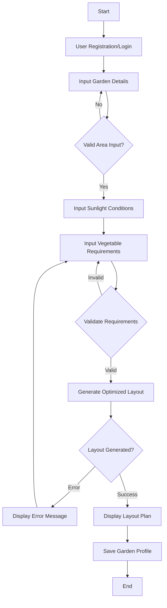

### Maintenance Schedule Workflow

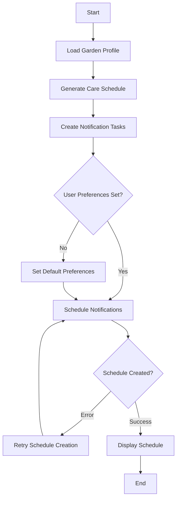

## 3.2. INTEGRATION WORKFLOWS

### Data Synchronization Flow

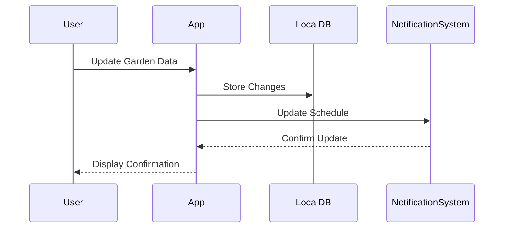

## 3.3. ERROR HANDLING FLOWS

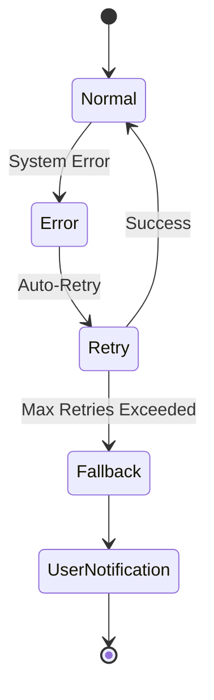

## 3.4. STATE MANAGEMENT

### Garden Optimization State Transitions

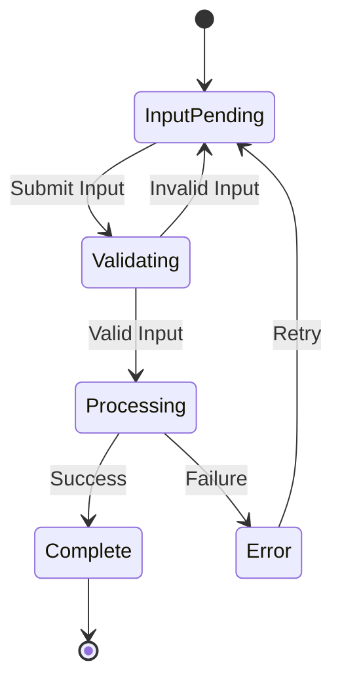

## 3.5. VALIDATION RULES

| Process Step | Validation Rules |
|-------------|------------------|
| Area Input | - Numeric value required<br>- Range: 1-1000 sq ft<br>- No special characters |
| Sunlight Input | - Must select predefined condition<br>- At least one zone defined |
| Vegetable Requirements | - Quantity > 0<br>- Supported vegetable types only |

## 3.6. TECHNICAL IMPLEMENTATION DETAILS

| Component | Implementation Requirements |
|-----------|---------------------------|
| State Persistence | - Local SQLite database<br>- Automatic backup<br>- Version control |
| Error Recovery | - Maximum 3 retry attempts<br>- 5-second retry intervals<br>- Fallback to default values |
| Cache Management | - Layout calculations cached<br>- 24-hour cache validity<br>- Clear on garden updates |

## 3.7. TIMING CONSTRAINTS

| Process | SLA Target |
|---------|------------|
| Layout Generation | < 3 seconds |
| Schedule Creation | < 2 seconds |
| Notification Delivery | Real-time |
| Data Sync | < 5 seconds |

# 4. SYSTEM ARCHITECTURE

## 4.1. HIGH-LEVEL ARCHITECTURE

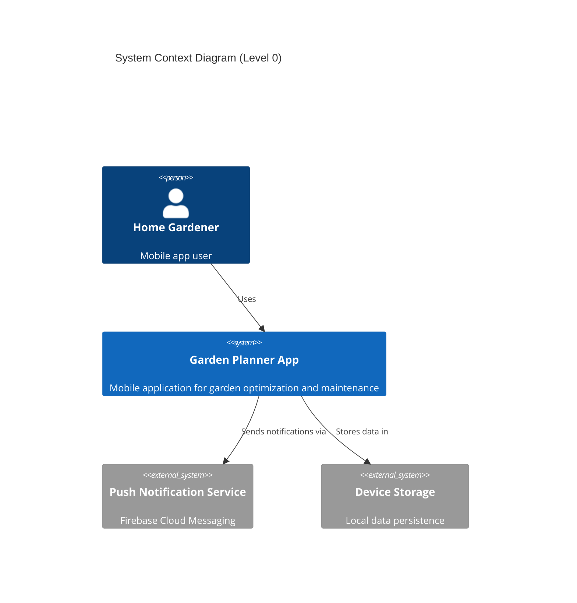

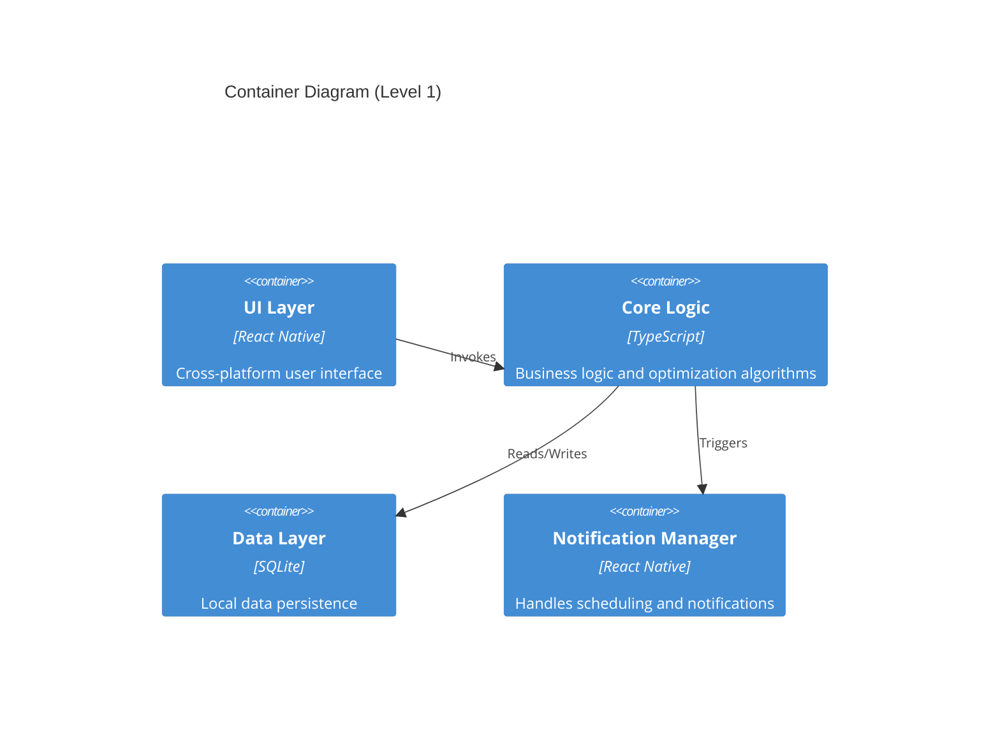

## 4.2. COMPONENT DETAILS

### Core Components

| Component | Purpose | Technology | Key Interfaces |
|-----------|---------|------------|----------------|
| UI Layer | User interaction | React Native | Core Logic API |
| Core Logic | Business rules, optimization | TypeScript | Data Layer API, UI API |
| Data Layer | Local storage | SQLite | Storage API |
| Notification Manager | Schedule management | React Native + FCM | Push Notification API |

### Data Persistence

| Entity | Storage Type | Sync Strategy | Retention |
|--------|--------------|---------------|-----------|
| Garden Layouts | SQLite | Local only | Permanent |
| Schedules | SQLite | Local only | 1 year |
| User Preferences | SQLite | Local only | Permanent |
| Plant Database | SQLite | Read-only bundle | Version-based |

## 4.3. TECHNICAL DECISIONS

### Architecture Choices

| Decision | Selection | Rationale |
|----------|-----------|-----------|
| App Architecture | Monolithic | Simplified deployment, offline-first |
| UI Framework | React Native | Cross-platform, performance |
| Storage | SQLite | Reliable local storage, offline support |
| State Management | Redux | Predictable state updates |

### Communication Patterns

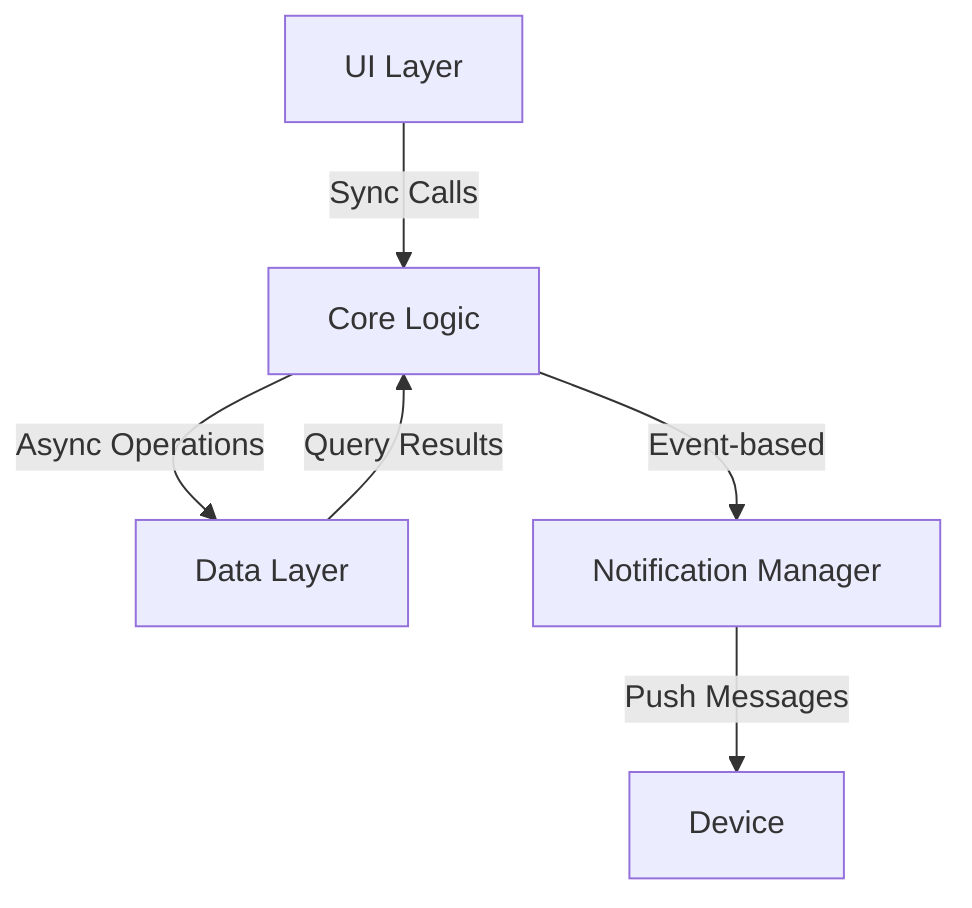

## 4.4. CROSS-CUTTING CONCERNS

### Monitoring and Logging

| Aspect | Implementation | Storage |
|--------|----------------|---------|
| Error Tracking | Sentry | Cloud Service |
| Analytics | Firebase Analytics | Cloud Service |
| Performance Metrics | React Native Performance | Local + Cloud |

### Security Architecture

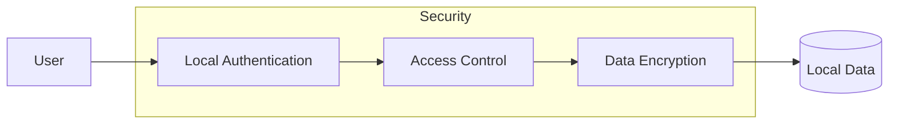

## 4.5. DEPLOYMENT ARCHITECTURE

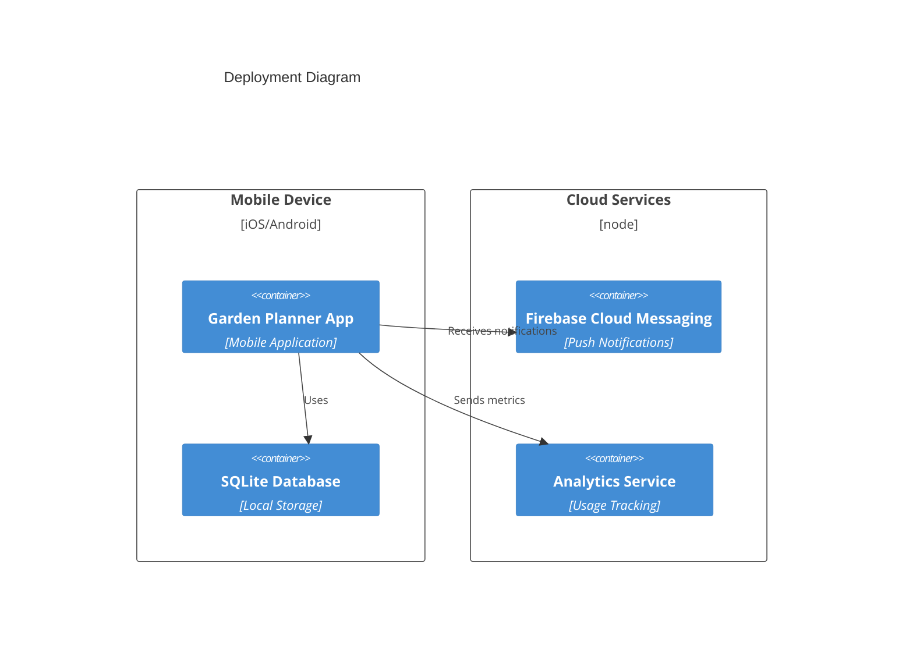

## 4.6. DATA FLOW ARCHITECTURE

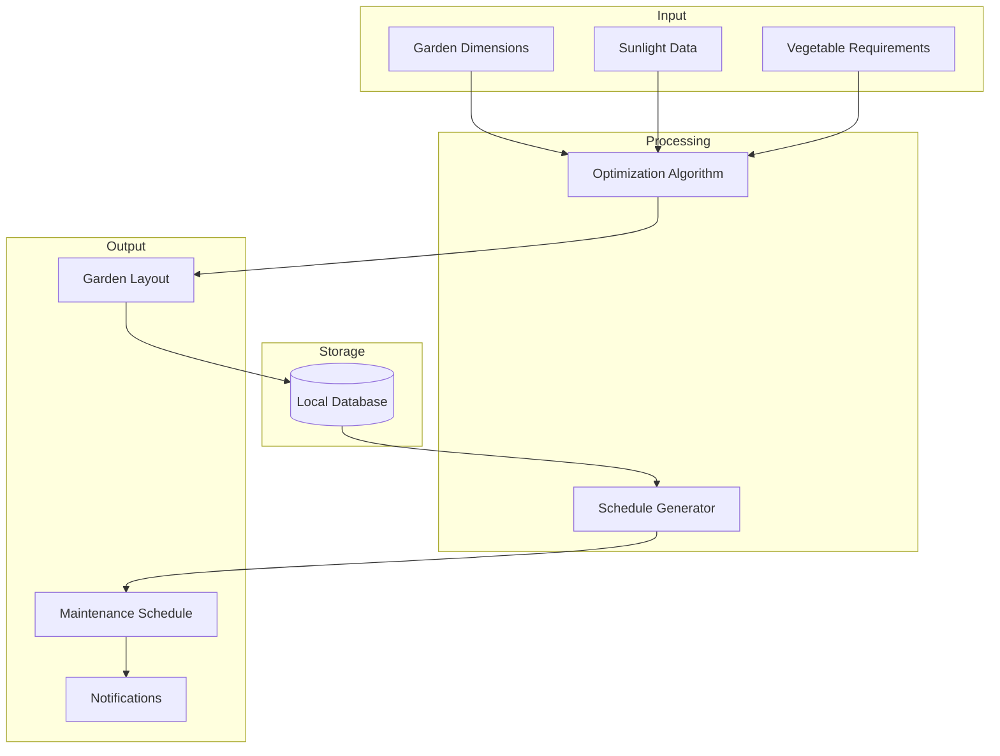

# 5. SYSTEM COMPONENTS DESIGN

## 5.1. CORE SERVICES ARCHITECTURE

### Service Components

| Service | Responsibility | Communication Pattern |
|---------|----------------|----------------------|
| Garden Optimizer | Space optimization calculations | Synchronous REST |
| Schedule Manager | Maintenance scheduling | Event-driven |
| Notification Service | Push notification handling | Asynchronous queue |
| Plant Database | Plant data management | Read-only cache |

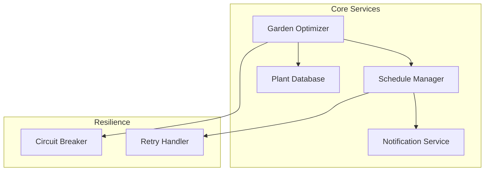

### Scalability Design

| Component | Scaling Approach | Triggers |
|-----------|-----------------|-----------|
| Garden Optimizer | Vertical | CPU > 80% |
| Schedule Manager | Horizontal | Queue depth > 1000 |
| Notification Service | Horizontal | Message latency > 2s |

### Resilience Patterns

| Pattern | Implementation | Recovery Time |
|---------|----------------|---------------|
| Circuit Breaker | Per service instance | 30 seconds |
| Retry Policy | Exponential backoff | Max 3 attempts |
| Fallback | Static cached data | Immediate |

## 5.2. DATABASE DESIGN

### Schema Design

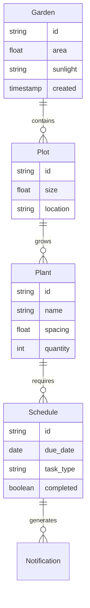

### Data Management

| Entity | Retention | Backup Frequency |
|--------|-----------|------------------|
| Garden | Permanent | Daily |
| Schedule | 1 year | Weekly |
| Notifications | 30 days | Monthly |

### Performance Optimization

| Strategy | Implementation | Impact |
|----------|----------------|---------|
| Caching | Local SQLite | 50ms response |
| Indexing | Compound indexes | 30% query improvement |
| Batching | 100 records/batch | Reduced I/O overhead |

## 5.3. INTEGRATION ARCHITECTURE

### API Design

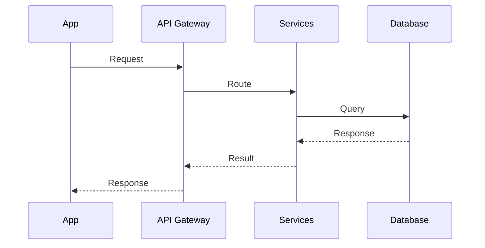

| Endpoint | Method | Rate Limit |
|----------|--------|------------|
| /garden | POST | 10/min |
| /schedule | GET | 30/min |
| /notifications | GET | 60/min |

### Message Processing

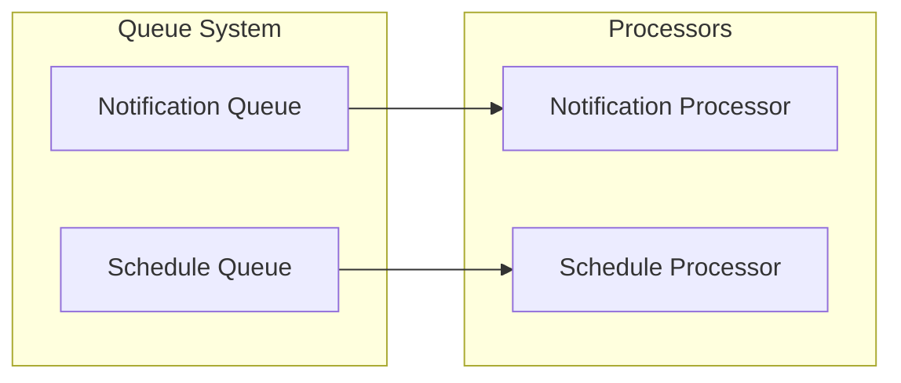

## 5.4. SECURITY ARCHITECTURE

### Authentication Framework

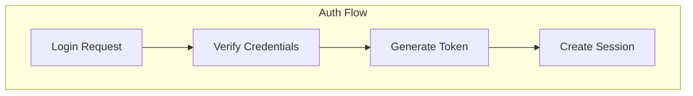

| Security Control | Implementation | Renewal |
|-----------------|----------------|----------|
| Session Token | JWT | 24 hours |
| Device Token | UUID | 30 days |
| Biometric | Local auth | Per session |

### Authorization System

| Role | Permissions | Scope |
|------|------------|-------|
| User | Read/Write | Own garden |
| Premium | Advanced features | All features |
| Admin | Full access | System-wide |

### Data Protection

| Data Type | Encryption | Storage |
|-----------|------------|---------|
| User Data | AES-256 | Local |
| Garden Plans | AES-256 | Local |
| Plant DB | None | Read-only bundle |

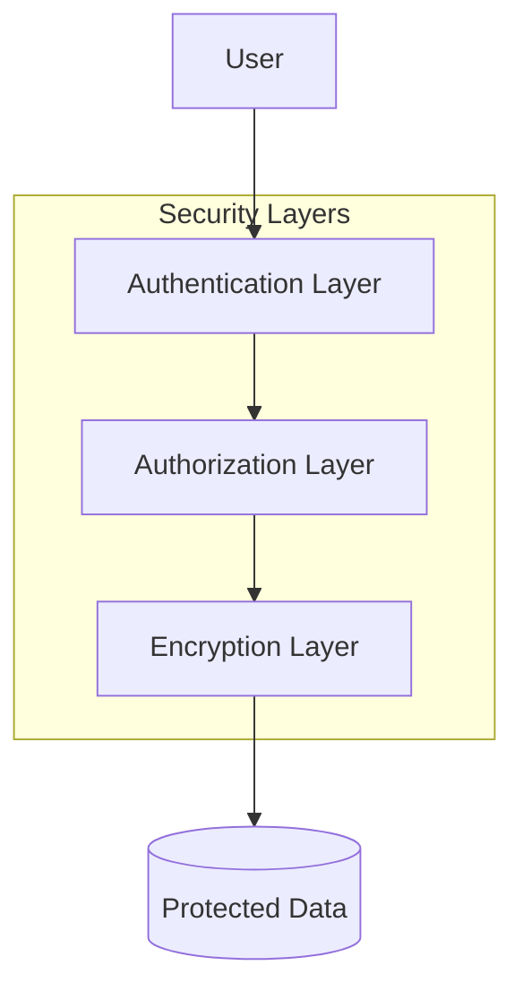

# 6. TECHNOLOGY STACK

## 6.1. PROGRAMMING LANGUAGES

| Platform/Component | Language | Version | Justification |
|-------------------|----------|---------|---------------|
| iOS | Swift | 5.9 | Native performance, modern syntax, Apple ecosystem support |
| Android | Kotlin | 1.9 | Official Android language, Java interoperability |
| Cross-platform | TypeScript | 5.0 | Type safety, React Native integration |
| Core Logic | TypeScript | 5.0 | Shared business logic, code reuse |

## 6.2. FRAMEWORKS & LIBRARIES

### Core Frameworks

| Framework | Version | Purpose | Justification |
|-----------|---------|---------|---------------|
| React Native | 0.72 | Cross-platform UI | Code sharing, native performance |
| Redux | 4.2 | State Management | Predictable state updates |
| React Navigation | 6.0 | Navigation | Deep linking, native transitions |

### Supporting Libraries

| Library | Version | Purpose |
|---------|---------|---------|
| SQLite | 2.1 | Local data storage |
| Firebase Cloud Messaging | 16.0 | Push notifications |
| React Native MMKV | 2.8 | Fast key-value storage |
| React Native Reanimated | 3.3 | UI animations |

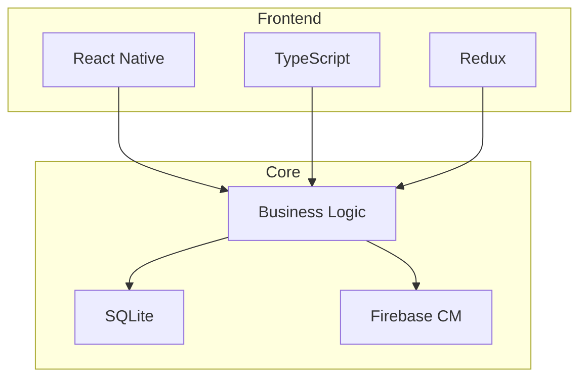

## 6.3. DATABASES & STORAGE

| Type | Technology | Purpose | Implementation |
|------|------------|---------|----------------|
| Primary Database | SQLite | Local data store | React Native SQLite |
| Cache Storage | MMKV | Fast key-value data | React Native MMKV |
| File Storage | FileSystem | Image/asset storage | React Native FS |
| State Persistence | Redux Persist | App state | Local storage |

### Data Architecture

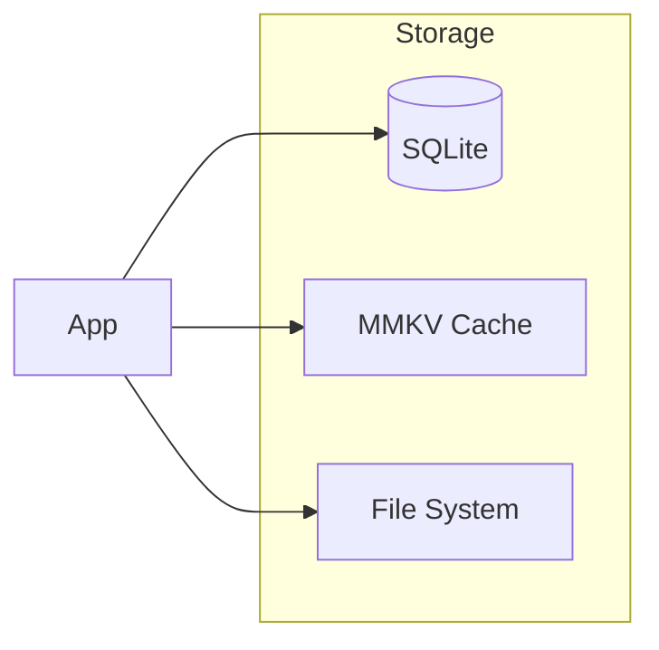

## 6.4. THIRD-PARTY SERVICES

| Service | Provider | Purpose | Integration |
|---------|----------|---------|-------------|
| Push Notifications | Firebase Cloud Messaging | User alerts | Native SDK |
| Analytics | Firebase Analytics | Usage tracking | React Native Firebase |
| Crash Reporting | Sentry | Error monitoring | Sentry SDK |
| Authentication | Local Auth | User security | Device biometrics |

## 6.5. DEVELOPMENT & DEPLOYMENT

### Development Tools

| Tool | Version | Purpose |
|------|---------|---------|
| Xcode | 15.0 | iOS development |
| Android Studio | 2023.1 | Android development |
| VS Code | Latest | Primary IDE |
| Jest | 29.0 | Testing framework |

### Build System

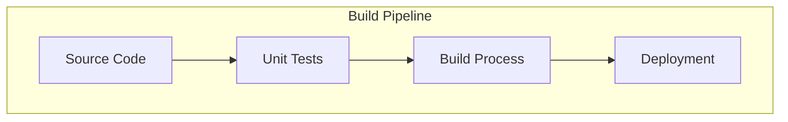

### Deployment Requirements

| Platform | Tool | Process |
|----------|------|---------|
| iOS | Fastlane | App Store deployment |
| Android | Gradle | Play Store publishing |
| CI/CD | GitHub Actions | Automated builds |
| Code Quality | ESLint/Prettier | Code standards |

### Development Environment

```mermaid
flowchart LR
    subgraph DevTools
        IDE[VS Code]
        Sim[Simulators]
        Git[Version Control]
    end
    
    subgraph Testing
        Unit[Jest]
        E2E[Detox]
    end
    
    DevTools --> Testing
    Testing --> Build[Build System]
```

# 7. USER INTERFACE DESIGN

## 7.1. WIREFRAME KEY

| Symbol | Meaning |
|--------|---------|
| [#] | Menu/Dashboard |
| [@] | User Profile |
| [?] | Help/Info |
| [+] | Add New |
| [x] | Close/Delete |
| [<] | Back Navigation |
| [=] | Settings |
| [...] | Text Input Field |
| [v] | Dropdown Menu |
| [ ] | Checkbox |
| [Button] | Action Button |
| [====] | Progress Bar |

## 7.2. MAIN SCREENS

### 7.2.1. Garden Setup Screen

```
+------------------------------------------+
|  [<] Garden Setup                    [@]  |
+------------------------------------------+
|                                          |
|  Garden Area                             |
|  [...................] sq ft             |
|                                          |
|  Sunlight Conditions                     |
|  [v] Select Zone                         |
|  +------------------+                    |
|  | Full Sun        |                    |
|  | Partial Shade   |                    |
|  | Full Shade      |                    |
|  +------------------+                    |
|                                          |
|  Vegetable Requirements                  |
|  +----------------------------------+    |
|  | Vegetable  | Qty/Day | Add       |    |
|  |------------|----------|-----------|    |
|  | Tomatoes   | [.....] | [+]       |    |
|  | Lettuce    | [.....] | [+]       |    |
|  | Carrots    | [.....] | [+]       |    |
|  +----------------------------------+    |
|                                          |
|        [Generate Garden Plan]            |
+------------------------------------------+
```

### 7.2.2. Optimized Layout View

```
+------------------------------------------+
|  [<] Garden Layout                   [?]  |
+------------------------------------------+
|                                          |
|  +----------------------------------+    |
|  |     Optimized Garden Layout      |    |
|  |     [Visual Grid Layout]         |    |
|  |     T T T    L L L    C C       |    |
|  |     T T T    L L L    C C       |    |
|  |     T T T    L L L              |    |
|  |                                  |    |
|  | T=Tomatoes                      |    |
|  | L=Lettuce                       |    |
|  | C=Carrots                       |    |
|  +----------------------------------+    |
|                                          |
|  Estimated Yield: 5.2 kg/month          |
|  Space Utilization: 92%                 |
|                                          |
|        [Accept Layout]  [Modify]         |
+------------------------------------------+
```

### 7.2.3. Maintenance Schedule

```
+------------------------------------------+
|  [<] Care Schedule                   [=]  |
+------------------------------------------+
|                                          |
|  Today's Tasks                           |
|  [ ] Water Tomatoes (Zone 1)            |
|  [x] Add Compost to Lettuce             |
|                                          |
|  Upcoming Tasks                          |
|  +----------------------------------+    |
|  | Date     | Task          | Plant |    |
|  |----------|---------------|--------|    |
|  | May 15   | Fertilizer    | Tomato |    |
|  | May 16   | Fungicide     | Lettuce|    |
|  | May 18   | Compost       | Carrots|    |
|  +----------------------------------+    |
|                                          |
|  Notification Settings                   |
|  [v] Reminder Time: 9:00 AM             |
|  [ ] Push Notifications                  |
|  [ ] Email Notifications                 |
|                                          |
|        [Update Preferences]              |
+------------------------------------------+
```

## 7.3. NOTIFICATION INTERFACES

### 7.3.1. Push Notification

```
+------------------------------------------+
|  Garden Care Reminder              [x]    |
|  Time to add fertilizer to Tomatoes      |
|  Zone: 1                                 |
|  [View Details]    [Mark Complete]       |
+------------------------------------------+
```

### 7.3.2. Task Details Modal

```
+------------------------------------------+
|  Task Details                      [x]    |
+------------------------------------------+
|                                          |
|  Task: Fertilizer Application            |
|  Plant: Tomatoes                         |
|  Location: Zone 1                        |
|                                          |
|  Instructions:                           |
|  - Use organic fertilizer                |
|  - Apply 2 tbsp per plant               |
|  - Water after application              |
|                                          |
|  Progress: [====    ] 50%               |
|                                          |
|  [Mark Complete]    [Postpone]           |
+------------------------------------------+
```

## 7.4. NAVIGATION STRUCTURE

```mermaid
flowchart TD
    A[Home Dashboard] --> B[Garden Setup]
    A --> C[Layout View]
    A --> D[Schedule View]
    B --> C
    C --> E[Task Details]
    D --> E
    A --> F[Settings]
    F --> G[Notification Preferences]
    F --> H[Profile Management]
```

## 7.5. RESPONSIVE DESIGN SPECIFICATIONS

| Screen Size | Layout Adjustments |
|-------------|-------------------|
| Small (< 375px) | Single column, stacked elements |
| Medium (376-768px) | Two column layout where appropriate |
| Large (> 768px) | Multi-column layout with side panel |

## 7.6. COLOR SCHEME

| Element | Color Code | Usage |
|---------|------------|-------|
| Primary | #2E7D32 | Headers, buttons |
| Secondary | #81C784 | Accents, icons |
| Background | #F5F5F5 | Main background |
| Text | #212121 | Primary text |
| Alert | #F44336 | Warnings, errors |

# 8. INFRASTRUCTURE

## 8.1. DEPLOYMENT ENVIRONMENT

| Environment Type | Platform | Purpose |
|-----------------|----------|----------|
| Development | Local Machines | Development and testing |
| Testing | Cloud-based | QA and integration testing |
| Production | App Stores | Public distribution |

### Environment Specifications

| Environment | Infrastructure | Scale |
|-------------|---------------|--------|
| iOS Production | App Store Connect | Global distribution |
| Android Production | Google Play Console | Global distribution |
| Development | Local development machines | Per developer |

## 8.2. CLOUD SERVICES

```mermaid
flowchart TD
    subgraph Cloud Infrastructure
        FCM[Firebase Cloud Messaging]
        FA[Firebase Analytics]
        CD[Cloud Database Backup]
    end
    
    subgraph Mobile Apps
        iOS[iOS App]
        And[Android App]
    end
    
    iOS --> FCM
    And --> FCM
    iOS --> FA
    And --> FA
    iOS -.-> CD
    And -.-> CD
```

### Service Requirements

| Service | Provider | Purpose | Tier |
|---------|----------|---------|------|
| Push Notifications | Firebase Cloud Messaging | User notifications | Spark Plan |
| Analytics | Firebase Analytics | Usage tracking | Free Tier |
| Error Tracking | Sentry | Crash reporting | Team Plan |
| App Distribution | App Store Connect & Play Console | Distribution | Standard |

## 8.3. CONTAINERIZATION

### Development Containers

```mermaid
flowchart LR
    subgraph Development Environment
        Dev[Developer Machine]
        Doc[Docker Container]
        Node[Node.js Environment]
    end
    
    Dev --> Doc
    Doc --> Node
    Node --> Build[Build Process]
```

| Container | Purpose | Base Image |
|-----------|---------|------------|
| react-native-dev | Development environment | node:18-alpine |
| ios-build | iOS build environment | swift:5.9 |
| android-build | Android build environment | openjdk:17 |

## 8.4. ORCHESTRATION

### Local Development Orchestration

```mermaid
flowchart TD
    subgraph Development
        DC[Docker Compose]
        NE[Node Environment]
        TS[TypeScript Compiler]
        MT[Metro Bundler]
    end
    
    DC --> NE
    NE --> TS
    TS --> MT
```

| Service | Configuration | Scale |
|---------|--------------|--------|
| Metro Bundler | Hot Reload enabled | Single instance |
| TypeScript Compiler | Watch mode | Per developer |
| Node Environment | Development mode | Single instance |

## 8.5. CI/CD PIPELINE

```mermaid
flowchart LR
    subgraph CI/CD Pipeline
        Git[GitHub Repository]
        Act[GitHub Actions]
        Test[Test Runner]
        Build[Build Process]
        Deploy[Deployment]
    end
    
    Git --> Act
    Act --> Test
    Test --> Build
    Build --> Deploy
```

### Pipeline Stages

| Stage | Tools | Actions |
|-------|-------|---------|
| Source Control | GitHub | Code versioning |
| CI | GitHub Actions | Build, test, lint |
| Testing | Jest, Detox | Unit, E2E testing |
| Build | Fastlane, Gradle | Platform builds |
| Deploy | App Store Connect API, Google Play API | Store deployment |

### Deployment Configuration

| Platform | Build Tool | Distribution |
|----------|------------|--------------|
| iOS | Fastlane | TestFlight → App Store |
| Android | Gradle | Internal → Production |

### Automation Scripts

```yaml
deployment:
  stages:
    - lint:
        command: eslint
        timeout: 5m
    - test:
        command: jest
        coverage: 80%
    - build:
        platforms:
          - ios
          - android
        parallel: true
    - deploy:
        conditions:
          branch: main
          tests: pass
```

## 8.6. MONITORING AND SCALING

| Aspect | Tool | Metrics |
|--------|------|---------|
| Performance | Firebase Performance | Response times, crashes |
| Usage | Firebase Analytics | DAU, retention |
| Errors | Sentry | Error rates, types |
| API Usage | FCM Console | Message delivery rates |

### Scaling Thresholds

| Resource | Metric | Threshold | Action |
|----------|--------|-----------|--------|
| Push Notifications | Delivery rate | 95% | Increase FCM quota |
| Analytics | Event count | 1M/day | Upgrade plan |
| Error Tracking | Error rate | 1% | Alert DevOps |

# APPENDICES

## A.1. ADDITIONAL TECHNICAL INFORMATION

### A.1.1. Plant Growth Parameters

| Parameter | Description | Impact on System |
|-----------|-------------|------------------|
| Growth Rate | Days to maturity | Schedule generation |
| Plant Spacing | Distance between plants | Space optimization |
| Companion Planting | Compatible neighbors | Layout algorithm |
| Sunlight Hours | Required daily exposure | Zone planning |
| Water Requirements | Frequency and amount | Notification scheduling |

### A.1.2. Space Optimization Algorithm Details

```mermaid
flowchart TD
    subgraph Algorithm Components
        I[Input Processing]
        Z[Zone Division]
        C[Compatibility Check]
        P[Plant Placement]
        O[Output Generation]
    end
    
    I --> Z
    Z --> C
    C --> P
    P --> O
    
    subgraph Constraints
        S[Sunlight Requirements]
        W[Water Access]
        G[Growth Space]
    end
    
    S --> C
    W --> C
    G --> P
```

## A.2. GLOSSARY

| Term | Definition |
|------|------------|
| Garden Zone | Distinct area within garden with specific sunlight conditions |
| Companion Planting | Practice of placing compatible plants near each other |
| Growth Cycle | Complete period from planting to harvest |
| Maintenance Schedule | Timed plan for plant care activities |
| Space Optimization | Process of maximizing garden area usage |
| Plant Database | Collection of plant characteristics and requirements |
| Care Task | Specific maintenance activity for plants |
| Layout Algorithm | Mathematical model for garden space arrangement |
| Notification Trigger | Event causing system to send user alert |
| User Preferences | Customized settings for app behavior |

## A.3. ACRONYMS

| Acronym | Full Form |
|---------|-----------|
| API | Application Programming Interface |
| FCM | Firebase Cloud Messaging |
| UI | User Interface |
| DB | Database |
| SQL | Structured Query Language |
| CRUD | Create, Read, Update, Delete |
| REST | Representational State Transfer |
| JWT | JSON Web Token |
| SDK | Software Development Kit |
| IDE | Integrated Development Environment |
| CI/CD | Continuous Integration/Continuous Deployment |
| DAU | Daily Active Users |
| QA | Quality Assurance |
| E2E | End-to-End |
| FS | File System |
| MMKV | Modified Memory Key-Value |

## A.4. MEASUREMENT UNITS

| Unit | Description | Usage in System |
|------|-------------|-----------------|
| sq ft | Square Feet | Garden area measurement |
| hrs | Hours | Sunlight exposure duration |
| kg | Kilograms | Vegetable yield measurement |
| cm | Centimeters | Plant spacing |
| L | Liters | Water quantity |
| tbsp | Tablespoon | Fertilizer measurement |

## A.5. ERROR CODES

| Code | Description | Resolution |
|------|-------------|------------|
| E001 | Invalid garden dimensions | Verify input range (1-1000 sq ft) |
| E002 | Incompatible plant combination | Adjust plant selection |
| E003 | Insufficient sunlight data | Complete zone information |
| E004 | Schedule generation failure | Retry or reset preferences |
| E005 | Notification delivery failure | Check device settings |

## A.6. PERFORMANCE METRICS

```mermaid
flowchart LR
    subgraph Key Performance Indicators
        RT[Response Time]
        CPU[CPU Usage]
        MEM[Memory Usage]
        STOR[Storage Usage]
    end
    
    subgraph Thresholds
        RT --> |Max 3s| OK
        CPU --> |Max 80%| OK
        MEM --> |Max 100MB| OK
        STOR --> |Max 500MB| OK
    end
```

## A.7. MAINTENANCE WINDOWS

| Activity | Frequency | Duration | Impact |
|----------|-----------|-----------|---------|
| Database Cleanup | Weekly | 30 mins | Read-only mode |
| Plant DB Update | Monthly | 1 hour | Background update |
| Cache Clear | Daily | 5 mins | None |
| Analytics Sync | Hourly | 1 min | None |